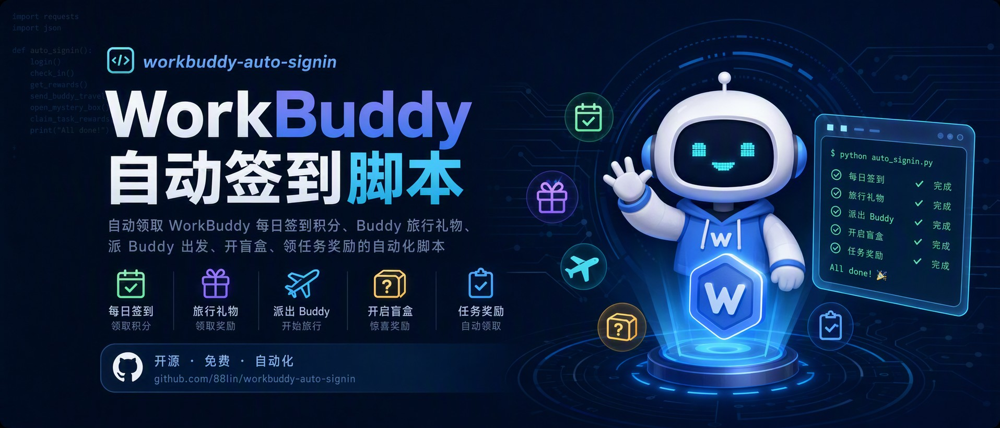

<div align="center">



# 🤖 workbuddy-auto-signin

**自动领取 WorkBuddy 每日签到积分的小脚本**

[](https://github.com/88lin/workbuddy-auto-signin/releases)
[](LICENSE)
[](https://www.python.org/)
[]()
[]()
[](https://github.com/88lin/workbuddy-auto-signin/stargazers)

</div>

> 一个自包含的 Python 脚本，每天自动帮你领取 **WorkBuddy**（腾讯 AI 编程助手）的每日签到积分。只读取你自己机器上的登录态，零内置密钥，可安全分享。

## 💖 赞助商

<table>
<tr>
<td width="180" align="center" valign="middle">
  <a href="https://agentrouter.org/register?aff=ugVO"></a>
</td>
<td valign="middle"><b><a href="https://agentrouter.org/register?aff=ugVO">Agent Router</a></b>&nbsp;是免费公益大模型API平台，支持GPT-5.6、claude-opus-5、glm-5.3、deepseek-v4-flash等主流模型，国内直连。注册送＄175（每日签到得＄25，被邀得＄50），支持GitHub/LinuxDo登录。</td>
</tr>
<tr>
<td width="180" align="center" valign="middle">
  <a href="https://anyrouter.top/register?aff=woX5"></a>
</td>
<td valign="middle"><b><a href="https://anyrouter.top/register?aff=woX5">Any Router</a></b>&nbsp;是免费公益大模型API平台，可用GPT-6-astra、claude-fable-5.1等顶级模型。被邀得＄50，每日签到随机额度。</td>
</tr>
<tr>
<td width="180" align="center" valign="middle">
  <a href="https://www.sheapi.top/sign-up?aff=MvcR"></a>
</td>
<td valign="middle"><b><a href="https://www.sheapi.top/sign-up?aff=MvcR">SheApi</a></b>&nbsp;是一家可靠高效的 API 中转服务提供商，主要提供 Claude Code、Codex 等主流模型的高稳定中转能力，Codex 倍率补贴低至 0.08，GPT-Image-2生图每张0.04。受邀注册送$1 体验金，每日签到还可领取专属免费额度。</td>
</tr>
<tr>
<td width="180" align="center" valign="middle">
  <a href="https://www.workbuddy.cn/events/invite?inviteCode=w0x2ic45z"></a>
</td>
<td valign="middle"><b><a href="https://www.workbuddy.cn/events/invite?inviteCode=w0x2ic45z">WorkBuddy</a></b>&nbsp;是腾讯出品的全能 AI 工作台，是中国最受欢迎的效率 AI 智能体服务，说出要求、开始执行任务、交付完整成果。其中Hy4模型限时免费使用，注册即可获取2000积分，每月再赠送500积分，可用Kimi-K3、GLM-5.3等模型。</td>
</tr>
<tr>
<td width="180" align="center" valign="middle">
  <a href="https://api.justwoker.icu/register?aff=wpiO"></a>
</td>
<td valign="middle"><b><a href="https://api.justwoker.icu/register?aff=wpiO">JustDoWork</a></b>&nbsp;是免费公益大模型API平台，可用Claude Opus 5 模型。注册送＄100（每日签到得＄30左右），支持GitHub登录。</td>
</tr>
</table>

---

## ✨ 特性

| | 特性 |
|:---:|---|
| 🧩 | **零依赖** — 纯 Python 标准库，不用 `pip install`，任意 Python 3 即可 |
| 📦 | **单文件** — 完全自包含 |
| 🔁 | **幂等安全** — 先查状态，未签才领；重复运行不会多领 |
| 🐱 | **成长中心** — 自动领旅行礼物、派 Buddy、领取新任务、领任务奖、断登自动补登、连登奖励兑换、开盲盒抽奖、能量开 Buddy 盲盒 |
| 🐾 | **成长中心轮询** — 一键安装自带：Buddy 一回来就领礼物并补派，把每日名额用满，不让礼物压到第二天 |
| ⏰ | **双定时模式** — AI 自动化（跨平台）或系统级静默（Win，零 token） |
| 🧠 | **智能汇报** — 一行 JSON，如 `成功领取 100 积分（连续 7 天，累计 700 积分）` |
| 🛡️ | **健壮** — 兼容"已签"两种返回形态、识别 401/403 登录态过期、识别非签到季 |
| 🌐 | **跨平台** — 自动探测 Windows / macOS / Linux 凭据文件 |
| 🔒 | **无密钥** — 仓库不含任何密钥，只读取运行者本机登录凭据 |

---

## 📋 前置条件

- ✅ 已安装并**登录过 WorkBuddy 桌面端**（登录后自动写出凭据文件，脚本靠它鉴权）
- ✅ 本机有 **Python 3**（任意版本，无需任何第三方包）
- ⬜ 可选：装了 `git` 就能直接 clone；没有的话去仓库页面 **Code → Download ZIP** 解压，效果一样

---

## ⏰ 每日定时自动化

本脚本依赖本机桌面端登录态，云端 CI（如 GitHub Actions）跑不了。提供**两种定时模式**，按需选择：

### 模式对比

| 对比项 | 模式 A：AI 自动化 | 模式 B：系统级静默 ⭐ |
|:---:|---|---|
| **平台** | 🌐 Win / macOS / Linux | 🪟 仅 Windows |
| **原理** | WorkBuddy 自动化触发 → AI 模型跑脚本 → 模型汇报 | Windows 任务计划程序 → `pythonw.exe` 直接跑脚本 → 写日志文件 |
| **Token 消耗** | 每次一次模型调用 | **零** |
| **聊天记录** | 每次一条 | **零** |
| **弹窗** | 无 | 无 |
| **可靠性** | 依赖模型可用性 | 纯系统级，更可靠 |
| **日志** | 在聊天记录里 | 独立日志文件 `signin.log` |
| **关机错过** | 错过就错过 | 可设"错过后下次启动时补跑" |
| **设置难度** | 中（clone + 填绝对路径 + 建自动化） | 低（一条命令，全自动） |

---

### 模式 A：AI 自动化（跨平台）

适合 macOS / Linux，或不想碰任务计划程序的人。由 WorkBuddy 的自动化定时触发，AI 模型跑一次脚本再汇报——**每次会消耗一次模型调用**。

**第 1 步 · 拿到脚本**

```bash
git clone https://github.com/88lin/workbuddy-auto-signin.git
cd workbuddy-auto-signin
```

记下 `signin.py` 的绝对路径，第 2 步要用，例如：

- macOS / Linux：`/Users/you/workbuddy-auto-signin/signin.py`
- Windows：`C:\Users\you\workbuddy-auto-signin\signin.py`

**第 2 步 · 新建自动化**

- **名称**：每日自动领 WorkBuddy 积分
- **计划**：每天 00:05
- **提示词**（自动化**每次触发时执行**的那一句）：

  ```text
  运行 <python> <signin.py 的绝对路径> auto，
  把命令输出的 JSON 里 report 字段的内容，直接一句话汇报给我。
  若 report 含"领取失败""登录态已失效""未找到登录凭据"或"网络不可达"，额外提醒我处理。
  ```

> [!NOTE]
> `<python>` 填你机器上的 Python 3 命令名：macOS / Linux 通常是 `python3`，Windows 通常是 `python`。拿不准就各跑一次 `python3 --version`、`python --version`，哪个有输出用哪个。

> [!TIP]
> **懒人一键**：上面两步都能省——直接把仓库链接丢给 WorkBuddy：
> `帮我把这个仓库跑起来并设置每天 00:05 自动签到：https://github.com/88lin/workbuddy-auto-signin`
> 它会自己 clone、建好自动化、把绝对路径和 Python 命令名一并填好。（这条是**一次性**的设置指令，和上面那条「每次触发时执行」的提示词不是一回事。）

> [!TIP]
> 还想要成长中心轮询？**再建一条自动化**即可：计划设为「每 4 小时」，提示词照抄上面那句，只把末尾的 `auto` 换成 `growth`（只跑成长中心，不重复签到）。

> [!NOTE]
> 模式 A 每次运行会消耗一次 AI 模型调用并产生一条聊天记录。签到逻辑本身是确定性代码，模型仅负责"跑命令 + 汇报"。

---

### 模式 B：系统级静默（Windows，推荐）

用 Windows 自带的任务计划程序 + `pythonw.exe`（无窗口 Python）直接运行脚本，**完全不经过 AI 模型**。

**第 1 步 · 拿到脚本**（本地已有仓库就跳过）

```bash
git clone https://github.com/88lin/workbuddy-auto-signin.git
cd workbuddy-auto-signin
```

**第 2 步 · 一键设置**（在仓库目录下运行，`pythonw.exe`、`signin.py` 全都自动探测）：

```powershell
powershell -ExecutionPolicy Bypass -File .\install-windows.ps1
```

它会自动建好两个任务：

| 任务 | 频率 | 干什么 |
|---|---|---|
| `WorkBuddyAutoSignin` | 每天 00:05 | 签到 + 成长中心，静默写 `signin.log` |
| `WorkBuddyGrowthPoll` | 每 4 小时 | 只跑成长中心：领礼物、派 Buddy、兑换、抽奖等全套 |

两个任务都零 Token、无窗口、关机错过后下次开机自动补跑。装完终端会打印结果和下次运行时间。

> [!NOTE]
> **为什么要两个任务**：签到一天一次就够了，成长中心却不是——Buddy 出去旅行 1~4 小时就带着礼物回来，礼物得手动领。只靠 00:05 那一次，礼物会压到第二天才到账；万一某天没跑成（关机），当天唯一的派出名额还会整个浪费掉。

> [!TIP]
> 探测不到 Python 时脚本会提示你手动填：编辑 `install-windows.ps1`，把顶部的 `$ManualPythonw` 改成 `pythonw.exe` 的完整路径即可（`$ManualSignin` 同理，一般不用动）。任意 Python 3 自带的 `pythonw.exe` 都行，不限于系统 Python。

**卸载**：

```powershell
Unregister-ScheduledTask -TaskName "WorkBuddyAutoSignin" -Confirm:$false
Unregister-ScheduledTask -TaskName "WorkBuddyGrowthPoll" -Confirm:$false
```

只要签到、不想要成长中心轮询的话，只删第二个就行。

**查看日志**：

```powershell
Get-Content signin.log -Tail 5   # 或用记事本打开
```

日志格式（每行一条 JSON）：

```
[2026-08-30 10:34:04] {"result": "ALREADY", "report": "今日已签过（今日 +100，连续 16 天，累计 1600 积分）", ...}
```

> [!TIP]
> **懒人一键**：直接把仓库链接发给 WorkBuddy，让它帮你装好——
> `帮我 clone 这个仓库并运行 install-windows.ps1 完成自动签到设置：https://github.com/88lin/workbuddy-auto-signin`

> [!NOTE]
> 模式 B 的 `silent` 参数让脚本把结果写入 `signin.log` 而非 stdout，配合 `pythonw.exe`（无控制台窗口）实现完全静默。日志文件路径可用环境变量 `WORKBUDDY_SIGNIN_LOG` 覆盖。

> [!IMPORTANT]
> **Buddy 旅行有每日名额限制**（服务端返回 `daily_limit_reached`），实测一天只能派出一次。轮询任务的作用是「及时把礼物领回来 + 补上当天错过的那次派出」，**不是**让你一天刷好几趟——脚本读到名额已用完会直接收手，不会去撞那堵墙。

> [!NOTE]
> 轮询一天要跑好几轮，所以**只有真领到东西或出错时才写日志**；「Buddy 还在路上」「今日名额已用完」这类空跑不落盘，免得有价值的记录被淹没。想逐轮查看就设 `WORKBUDDY_GROWTH_LOG_EMPTY=1`。

---

## 🛠️ 手动运行（调试用）

如需手动跑一次确认脚本可用：

```bash
git clone https://github.com/88lin/workbuddy-auto-signin.git
cd workbuddy-auto-signin
python signin.py auto
```

看到 `今日已签过` 或 `成功领取 N 积分` 就说明通了。

> [!NOTE]
> 下文所有命令都以 `python` 为例。macOS / Linux 上若提示 `command not found`，把 `python` 换成 `python3` 即可。

<details>
<summary>📖 全部命令</summary>

```
python signin.py auto           # 签到 + 成长中心（礼物 / 任务 / 补登 / 连登兑换 / 抽奖 / Buddy）
python signin.py silent         # 同 auto，但输出写入日志文件而非 stdout（配合定时任务静默运行）
python signin.py growth         # 仅成长中心（不签到）
python signin.py silent-growth  # 仅成长中心 + 写日志文件（配合模式 B 的成长中心轮询任务）
python signin.py status         # 仅查签到状态（调试）
python signin.py claim          # 仅领取签到（调试，幂等）
python signin.py all            # 查签到状态 + 领取（调试）
```

</details>

---

## ⚙️ 工作原理

登录后，WorkBuddy 桌面端写出明文 JSON 会话文件 `workbuddy-desktop.info`（含 `accessToken`）。脚本流程：

1. 📂 **定位**凭据文件（自动探测，或用 `WORKBUDDY_AUTH_FILE` 覆盖）
2. 🔍 **查询** `POST /v2/billing/meter/checkin-activity-status` — 今天是否已领？
3. 🎁 **领取** 若未领，`POST /v2/billing/meter/daily-checkin`
4. 🐱 **成长中心** 领旅行礼物 → 派 Buddy → 领取新任务（进度从领取才开始计）→ 领任务奖 → 断登自动补登（有补登卡时，每轮最多补一天）→ 连登奖励兑换 → 开盲盒 → 能量开 Buddy 盲盒
5. 📤 **输出** 一行 JSON，`report` 字段是人话汇报

> [!NOTE]
> 网络失败（GET 请求）自动重试 1 次；抽奖、领奖等写操作**不**重试，避免超时发生在服务端处理完成之后造成重复提交。两个签到接口例外——状态查询是只读的，领取接口本身幂等（见上文响应契约），故允许重试。整个运行受时间预算约束，详见「配置」。

> [!NOTE]
> 所有请求都打到官方客户端用的同一个 endpoint（`https://copilot.tencent.com`）。签到接口系从桌面端 `app.asar` 逆向得到，仅供个人自动化使用。

---

## 🔧 配置

| 环境变量 | 作用 |
|---|---|
| `WORKBUDDY_AUTH_FILE` | 自动探测失败时，手动指定凭据文件路径 |
| `WORKBUDDY_SIGNIN_LOG` | `silent` 模式下日志文件路径（默认 `signin.log`） |
| `WORKBUDDY_BUDGET_SECONDS` | 单次运行的网络请求时间预算。签到类命令默认 `420`（7 分钟）、上限 `540`；`silent-growth` 轮询默认 `120`、上限 `240`。**须为正数且小于对应定时任务的 `ExecutionTimeLimit`**。非法值、`≤0` 或超上限都会夹到安全值，并在输出里附 `config_warning` |
| `WORKBUDDY_GROWTH_LOG_EMPTY` | 设为 `1`（或 `true`/`yes`/`on`）时，`silent-growth` 连空跑也写日志；默认只在领到东西或出错时记录 |

> [!NOTE]
> 时间预算须小于计划任务的 `ExecutionTimeLimit`。两个任务的时限不同，所以上限也分开算：签到任务 PT10M → 上限 `540`，轮询任务 PT5M → 上限 `240`，各留 60 秒给解释器启动和收尾。网络异常时单个请求最坏要耗 30 秒，若不设上限，接口逐个超时会把任务跑穿被系统强杀——而结果是在最后才写日志的，当天记录会整条丢失。预算耗尽时脚本主动收尾并如实记录，剩余项留到下次。
>
> 若你要调整某个任务的 `ExecutionTimeLimit`，须同步改 `signin.py` 顶部对应的 `MAX_BUDGET_SECONDS` / `POLL_MAX_BUDGET_SECONDS`（分别对应签到任务与轮询任务）。

---

## 🧪 排错

| 现象 | 处理 |
|---|---|
| `NO_AUTH / 未找到登录凭据` | 先登录一次 WorkBuddy 桌面端；或设置 `WORKBUDDY_AUTH_FILE` |
| `NO_AUTH / WORKBUDDY_AUTH_FILE 指向的文件不存在` | 环境变量路径写错了——核对 `looked_in` 字段里的实际路径 |
| `NO_SESSION / HTTP 401\|403` | 登录态过期——重新登录桌面端，自动化自动恢复 |
| `INACTIVE / 签到活动未开启` | 非签到季，属正常，无需处理 |
| `NETWORK / 网络不可达` | 断网或服务端不可用，**非**登录问题。GET 请求会自动重试 1 次；下次运行自动重试 |
| `TIMEOUT / 已达本次运行时间预算` | 网络严重超时导致预算耗尽，已领到的部分照常记录，剩余项下次再领 |
| `ERROR / 登录凭据文件不是合法 JSON` | 本地凭据文件损坏——重新登录一次 WorkBuddy 桌面端即可重建 |
| `ERROR / 脚本运行异常（...）` | 异常不会静默丢失：silent 模式会写进 `signin.log`；可重跑 `python signin.py status` 看原始返回 |
| `signin.log` 里查不到轮询记录 | 正常——空跑（Buddy 还在路上 / 今日名额已用完）默认不落盘。想逐轮查看就设 `WORKBUDDY_GROWTH_LOG_EMPTY=1` |
| 轮询任务一直显示"今日旅行名额已用完" | 服务端每日只放行一次派出，当天已派过就会这样，属正常。第二天自动恢复 |
| 调试原始返回 | `python signin.py status` 或 `python signin.py all` |

> [!IMPORTANT]
> 登录态失效时脚本会明确返回 `NO_SESSION` 并提醒重新登录桌面端；重新登录后自动化无需任何改动即自动恢复。

---

## 🔐 安全与隐私

- 脚本只读取**你自己本机**的 WorkBuddy 会话文件，不含、不内嵌、不传输任何第三方密钥
- 永远不会打印 `accessToken`，`Authorization` 头不会出现在日志里
- 可安全 fork、分享、在自己机器上运行——它只作用于**你自己的**登录态

---

## ⚠️ 免责声明

> [!WARNING]
> 本项目为**非官方**工具，与腾讯或 WorkBuddy 无任何隶属关系。签到接口系从桌面端 `app.asar` 逆向得到。使用风险自负；接口可能随时变动且不另行通知。请遵守相关服务条款。

---

## 📊 Star History

<picture>
  <source media="(prefers-color-scheme: dark)" srcset="https://raw.githubusercontent.com/88lin/workbuddy-auto-signin/star-history/assets/my-star-history/star-history-dark.svg">
  
</picture>

---

## 📄 协议

[MIT](LICENSE) © 2026 88lin
